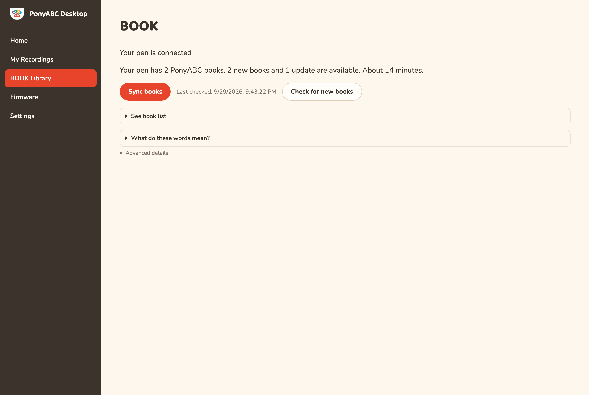
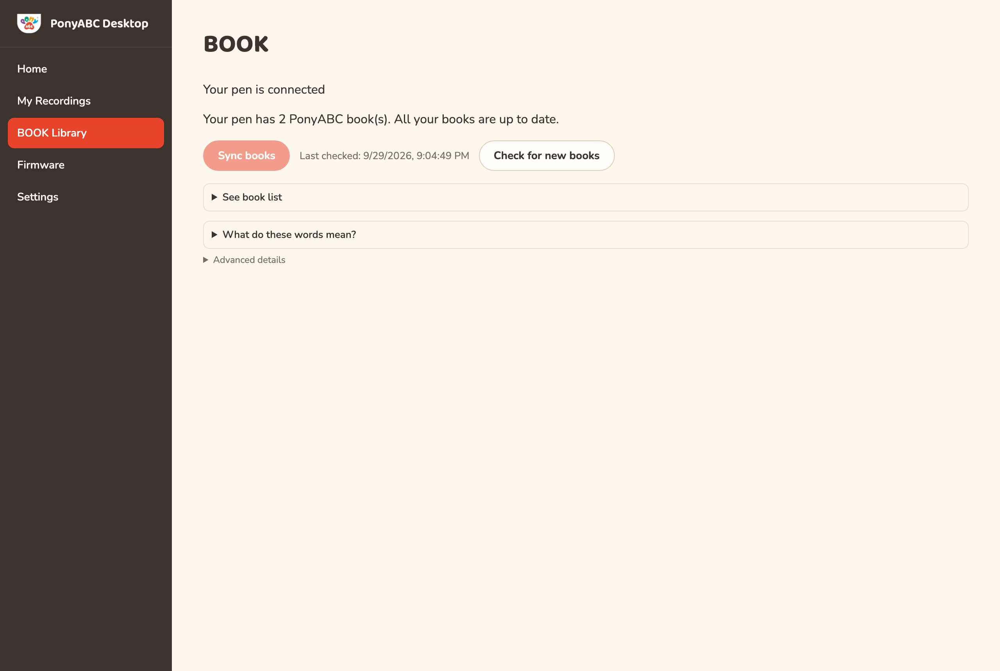
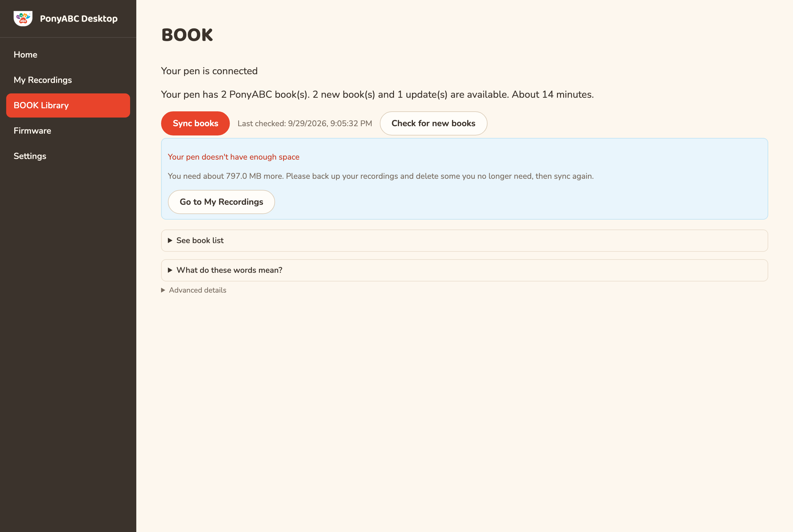

# PonyABC Desktop — a short guide

For the PonyABC P5 reading pen. Version 0.3.17.

This app does four things: it puts books on your pen, keeps a copy of your child's recordings,
updates the pen itself, and tells you when something needs your attention. You do not need to
know anything technical to use it.

---

## 1. Install it

1. Open the **Microsoft Store** on your Windows computer.
2. Search for **PonyABC Desktop**, or go to
   <https://apps.microsoft.com/detail/9P544XC6B609>.
3. Select **Get**, then **Open**.

There is nothing to set up afterwards.

*On a Mac you can manage books and recordings, but not update the pen itself — see section 6.*

## 2. Connect your pen

Use the **USB cable** that came with the pen, plugged into your computer.

A Bluetooth connection is not enough. The pen has to appear as a drive on your computer for the
app to put anything on it, and only the cable does that.

When it is connected the app says, at the top of the **BOOK Library** page:

> **Your pen is connected**

If it says *"Please connect your pen with its USB cable"*, try a different cable or a different
USB socket. Some cables are made for charging only and cannot carry data.

## 3. Put books on your pen

Go to **BOOK Library**. The app tells you, in one line, what it would do:

> Your pen has 2 PonyABC books. 2 new books and 1 update are available. About 14 minutes.

Select **Sync books**. That is the whole thing — you do not choose books, and you cannot remove
them by accident.

While it works, keep the pen plugged in:

> **Please don't unplug your pen**
> Your pen is being written to. Unplugging now could leave a book unfinished.

> **📷 A photo of this screen while it is working goes here.**
> *(To be taken during the real-pen test session.)*

**It takes a while, and that is normal.** The pen reads and writes slowly — about a megabyte a
second — so a large book can take twenty minutes. The app tells you roughly how long before it
starts, and counts down while it goes. You can leave it and come back.

### When everything is already up to date

> All your books are up to date.

Nothing to do. Select **Check for new books** any time you want to look again.

## 4. Switch your pen off and on

When books have been **added**, the app finishes with:

> **All done!**
> Please unplug your pen, then switch it off and on again. The first start may take a little
> longer while your pen gets its books ready.

Please do this. The pen builds its own list of books when it starts, and until it has, a new book
will not play.

**The first start after adding books is slower than usual.** The pen is working, not stuck. Leave
it on until it responds.

*If you only **updated** a book you already had, no restart is needed and the app will not ask
for one.*

## 5. If your pen runs out of space

> **Your pen doesn't have enough space**
> You need about 800 MB more. Please back up your recordings and delete some you no longer need,
> then sync again.

Nothing has been written to your pen, and nothing is broken. The app checks before it starts
precisely so you are not left half-way.

Select **Go to My Recordings**, back up your recordings to this computer, then delete the ones
you no longer need from the pen. Your backed-up copies stay on the computer.

## 6. Update the pen itself (Windows only)

Occasionally the pen's own software needs updating. Go to **Firmware** and follow the steps.

- Windows will ask your permission partway through. Please say yes — it cannot continue
  otherwise.
- **Do not unplug the pen** while it runs.
- When it finishes, switch the pen off and on and try one of your books.

If you say no to the Windows prompt, nothing happens to your pen at all and you can try again.

This is not available on a Mac.

## 7. Your child's recordings

Go to **My Recordings**.

- **Back up my recordings** copies everything on the pen to this computer. Do this before you
  delete anything.
- **Put these back on my pen** restores from a backup. If a recording already exists on that
  sticker number, the app plays you both and asks which to keep — it never chooses for you.
- **Rename** gives a recording a name you will recognise. The name stays on this computer; the
  pen always uses the sticker number.
- **Change sticker number** moves a recording to a different sticker. Type the number exactly as
  it is printed, including any zeros at the start.
- **Delete from pen** always saves a copy to this computer first.

## 8. What the words mean

| The app says | It means |
| --- | --- |
| **Your pen is connected** | The app can see your pen and can put books on it. |
| **Up to date** | This book is the current version. Nothing to do. |
| **Update available** | There is a newer version of this book. Sync will replace it. |
| **Other books (not from PonyABC)** | Books that came from somewhere else. The app never changes them. |
| **All done!** | The sync finished. Unplug and restart the pen. |

There is a **What do these words mean?** section on the BOOK Library page with the same list, and
an **Advanced details** section below it for anything our support team asks you to open.

## 9. If something goes wrong

**The app says my pen isn't connected.** Try the other end of the cable, a different USB socket,
and a different cable. Charging-only cables are common and will not work.

**A book I added doesn't play.** Switch the pen off and on and wait for it to finish starting. If
it still does not play, open the app with the pen connected — if it offers **Fix my pen's book
list**, select it, then restart the pen again.

**The app says it couldn't check my pen's free space.** Unplug the pen, plug it in again, and try
again.

**It has been copying for a long time.** That is usually normal — a large book takes about twenty
minutes. The progress bar moves slowly but it does move.

**Something else.** Go to **Settings** → **Export diagnostics**, and send us the file it saves.
It contains a record of what the app did, which is how we can tell what happened.

---

*PonyABC · <https://ponyabc.uk>*
