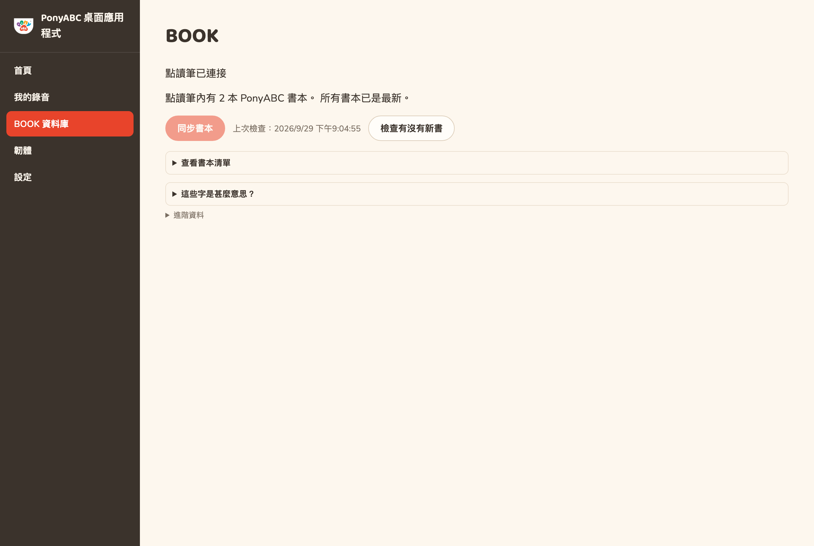
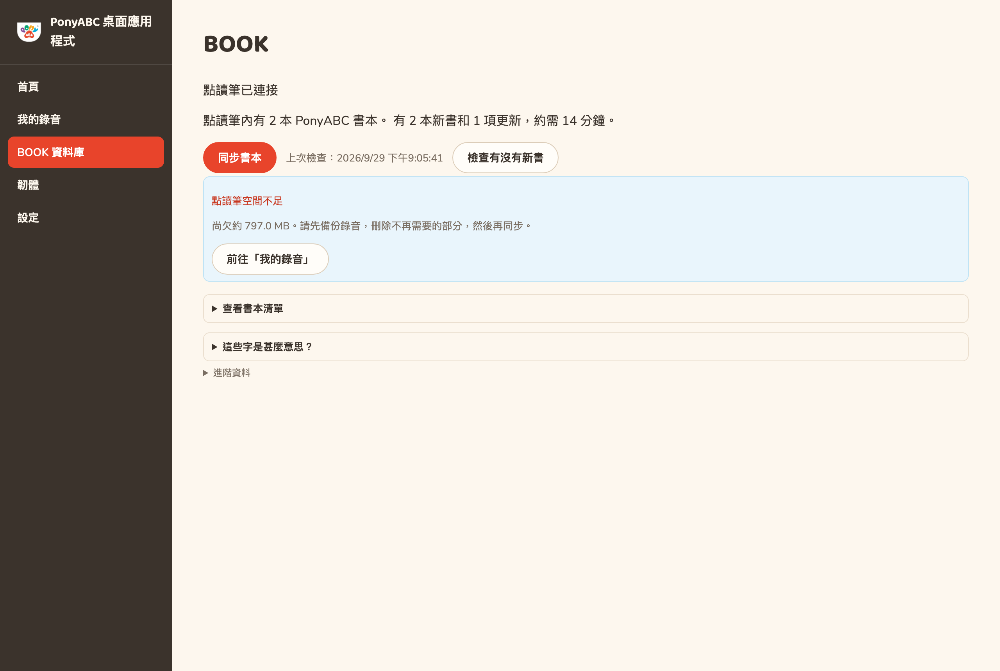

# PonyABC Desktop — 簡明指南

適用於 PonyABC P5 點讀筆。版本 0.3.17。

本程式有四個用途：把書本放進點讀筆、保存孩子的錄音、更新點讀筆本身，以及在需要你留意時提醒你。
使用時不需要任何技術知識。

---

## 1. 安裝

1. 在 Windows 電腦開啟 **Microsoft Store**。
2. 搜尋 **PonyABC Desktop**，或前往
   <https://apps.microsoft.com/detail/9P544XC6B609>。
3. 按 **取得**，然後按 **開啟**。

安裝後不需要任何設定。

*在 Mac 上可以管理書本和錄音，但不能更新點讀筆本身，詳見第 6 節。*

## 2. 連接點讀筆

請使用點讀筆隨附的 **USB 線**，接到電腦上。

只用藍牙並不足夠。點讀筆必須在電腦上顯示為一個磁碟，本程式才能寫入內容，而這只有用線連接才做得到。

連接成功後，**BOOK 資料庫**頁面頂部會顯示：

> **點讀筆已連接**

如果顯示「請用 USB 線連接點讀筆」，請換一條線或換一個 USB 插口。有些線只供充電，無法傳輸資料。

## 3. 把書本放進點讀筆

進入 **BOOK 資料庫**。本程式會用一句話說明將會做甚麼：

> 點讀筆內有 2 本 PonyABC 書本。可加入 2 本新書，並更新 1 項更新。約需 14 分鐘。

按 **同步書本**，這樣就可以了。你不需要逐本選擇，也不會誤刪任何書本。

進行期間，請保持點讀筆連接電腦：

> **請勿拔出點讀筆**
> 正在寫入點讀筆。此時拔出可能令書本未能完整複製。

> **📷 此處放置同步進行中的實機相片。**
> *（將於實機測試時拍攝。）*

**需要一段時間，這是正常的。** 點讀筆的讀寫速度較慢，每秒約一 MB，所以一本較大的書本可能需要二十分鐘。
本程式會在開始前告訴你大約需時多久，過程中也會倒數。你可以先做別的事，稍後再回來看。

### 如果全部已是最新

> 所有書本已是最新。

不需要任何操作。想再檢查一次，隨時可按 **檢查有沒有新書**。

## 4. 將點讀筆關機再開啟

如果有**新增**書本，完成後會顯示：

> **完成！**
> 請拔出點讀筆，然後關機再開啟。第一次開機可能需要較長時間準備書本。

請務必照做。點讀筆開機時會自行整理書本清單，未整理好之前，新加入的書本不會播放。

**新增書本後的第一次開機會比平時慢。** 點讀筆正在運作，並非當機，請讓它開著直到有反應為止。

*如果只是**更新**原有的書本，則不需要重新開機，本程式也不會提示你這樣做。*

## 5. 如果點讀筆空間不足

> **點讀筆空間不足**
> 尚欠約 800 MB。請先備份錄音，刪除不再需要的部分，然後再同步。

此時點讀筆並未被寫入任何資料，也沒有任何損壞。本程式會在開始前先檢查，正是為了避免做到一半才出問題。

請按 **前往「我的錄音」**，先把錄音備份到這部電腦，再從點讀筆刪除不再需要的錄音。已備份的副本會保留在電腦上。

## 6. 更新點讀筆本身（只限 Windows）

點讀筆本身的軟件偶爾需要更新。請進入 **韌體**，然後按指示操作。

- 過程中 Windows 會要求你授權，請按「是」，否則無法繼續。
- 進行期間**請勿拔出點讀筆**。
- 完成後，請將點讀筆關機再開啟，並試播一本書。

如果你在 Windows 的提示中選了「否」，點讀筆不會有任何改動，可以稍後再試。

Mac 上沒有此功能。

## 7. 孩子的錄音

請進入 **我的錄音**。

- **備份我的錄音**：把點讀筆內的錄音全部複製到這部電腦。刪除任何錄音前，請先做這一步。
- **放回點讀筆**：從備份還原。如果該貼紙號碼已有錄音，本程式會讓你試聽兩段再選擇保留哪一段，不會代你決定。
- **改名**：為錄音改一個你認得的名稱。名稱只儲存在這部電腦，點讀筆一律使用貼紙號碼。
- **更改貼紙號碼**：把錄音移到另一張貼紙。請照貼紙上印的號碼準確輸入，包括開頭的 0。
- **從點讀筆刪除**：刪除前一定會先在電腦保存副本。

## 8. 各個用語的意思

| 畫面顯示 | 意思 |
| --- | --- |
| **點讀筆已連接** | 本程式可以看到點讀筆，並可寫入書本。 |
| **已是最新** | 這本書已是現行版本，不需處理。 |
| **有更新版本** | 這本書有較新版本，同步時會更換。 |
| **其他書本（並非來自 PonyABC）** | 來自其他來源的書本，本程式不會作任何改動。 |
| **完成！** | 同步已完成，請拔出點讀筆並重新開機。 |

BOOK 資料庫頁面設有 **這些字是甚麼意思？** 一節，內容與上表相同；下方的 **進階資料** 則供客服請你展開時使用。

## 9. 遇到問題時

**程式顯示未連接點讀筆。** 請試換線的另一端、換一個 USB 插口，或換一條線。市面上有不少只供充電的線，無法傳輸資料。

**新加入的書本無法播放。** 請將點讀筆關機再開啟，並等它完成啟動。若仍然無法播放，請在連接點讀筆的情況下開啟本程式；
如果出現 **整理點讀筆的書本清單**，請按下它，然後再次重新開機。

**程式顯示無法檢查剩餘空間。** 請拔出點讀筆，重新插入後再試。

**複製了很久仍未完成。** 這通常是正常的，一本較大的書本約需二十分鐘。進度列移動得慢，但確實在移動。

**其他問題。** 請前往 **設定** → **匯出診斷資料**，並把儲存的檔案傳給我們。檔案記錄了本程式做過的事，
我們可以據此判斷發生了甚麼。

---

*PonyABC · <https://ponyabc.uk>*
